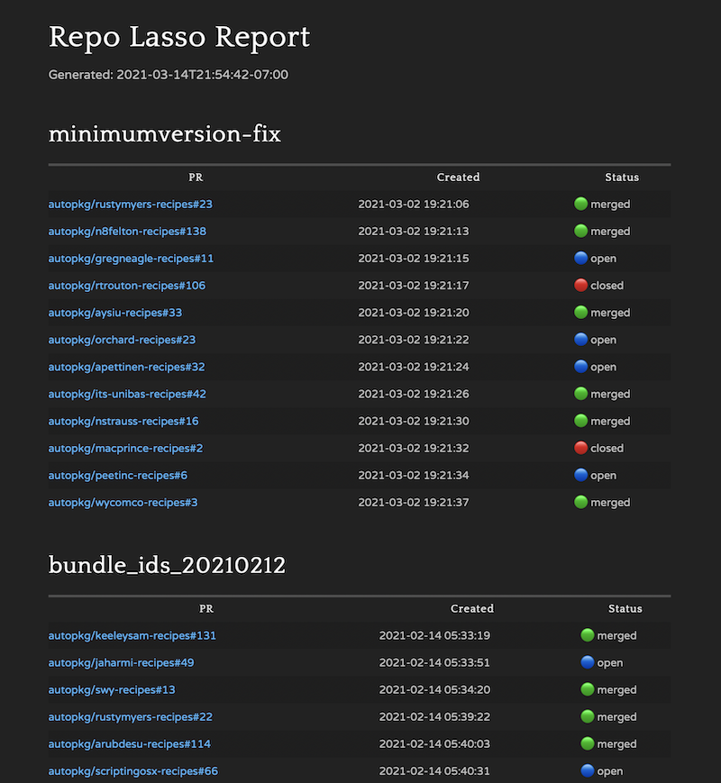

# Repo Lasso

**Repo Lasso is a tool that enables GitHub organization contributors/maintainers to submit nearly-identical pull requests in bulk across multiple organization repositories at once.** The changes can be anything from complex refactoring to simple typo fixes. Repo Lasso takes care of the per-repo Git and GitHub actions seamlessly so you can focus on the code improvements.

The name refers to the tool used by ranchers to catch stray livestock and guide them back to safety. But it's also a nod to [Ted Lasso](https://tv.apple.com/us/show/ted-lasso/umc.cmc.vtoh0mn0xn7t3c643xqonfzy), and the spirit of driving a team to greatness through collaboration and heartfelt feedback rather than by brute force.

## Example initiatives

Repo Lasso uses the term *initiative* to describe a change or set of changes across multiple repositories that addresses a specific issue or goal. The desired end result of an initiative is to open a series of detailed, focused, and nearly-identical pull requests against the affected repositories.

Here are some groups of pull requests I've created with this tool, to demonstrate the types of initiatives that Repo Lasso handles well:

- [**Misplaced pkgname key**](https://github.com/search?q=org%3Aautopkg+%22Adjust+PkgCreator+arguments%22+is%3Apr+author%3Ahomebysix): One or more early AutoPkg recipes with a misplaced `pkgname` key had been used as a template by many recipe authors over years, requiring a correction on **307** files across **54** repositories.

- [**Unused BUNDLE_ID key removal**](https://github.com/search?q=org%3Aautopkg+%22Remove+unused+BUNDLE_ID+input+var%22+is%3Apr+author%3Ahomebysix): Recipes adopted the AppPkgCreator processor, leaving the `BUNDLE_ID` key unused. This change affected **298** files across **44** repositories.

- [**Updating URLs to HTTPS**](https://github.com/search?q=org%3Aautopkg+%22Update+all+available+URLs+from+HTTP+to+HTTPS%22+is%3Apr+author%3Ahomebysix): It's [highly recommended](https://www.elliotjordan.com/posts/autopkg-https/) to use HTTPS URLs in AutoPkg recipes whenever possible. I paired Repo Lasso with my [HTTPS Spotter script](https://gist.github.com/homebysix/66d1c8772baf5f731bb8ddf263f33401#file-https_spotter-py) to switch to HTTPS URLs in **133** files across **50** repositories.

- [**MinimumVersion Fix**](https://github.com/search?q=org%3Aautopkg+%22Fix+MinimumVersion+key%22+is%3Apr+author%3Ahomebysix): A typo in a template had propagated in the wild, and affected **83** files across **14** repositories.

- [**Incorrect CodeSignatureVerifier key**](https://github.com/search?q=org%3Aautopkg+%22Adjust+name+of+CodeSignatureVerifier+argument%22+is%3Apr+author%3Ahomebysix): Some authors had been using an incorrect key, and the issue was difficult to detect because it failed silently during AutoPkg runs. Corrections were issued for **58** files across **19** repositories.

The 181 pull requests represented by the examples above took a _fraction_ of the time that they would have taken me to do manually.

## Setup

### Requirements

You'll need to have these items installed:

- Git
- Python 3 (virtualenv optional)

You'll also need a GitHub account, and a [personal access token](https://github.com/settings/tokens) associated with that account. **The token must be a "classic" token, and needs only the `public_repo` scope enabled.**

I also recommend generating an SSH key on the device you plan to use Repo Lasso on, and [putting that SSH key on GitHub](https://github.com/settings/keys).

Repo Lasso has been tested on macOS and Ubuntu, but should work on other platforms as well.

### Installation

To install, clone this repository from GitHub:

    git clone https://github.com/homebysix/repo-lasso repo-lasso && cd $_

Then install the Python requirements (you can do this within a virtualenv, if you prefer):

    pip3 install -r requirements.txt

### Configuration

In order to do its work, Repo Lasso needs to know a few things like your GitHub username, the GitHub organization you'll be targeting, and your GitHub classic personal access token. Repo Lasso stores these facts in a file named `config.json`. There are three ways to configure this file:

1. **Interactively:** The first time you run one of the commands below, you'll be prompted for any missing configuration details. This is the easiest way to get started.

1. **Using CLI Arguments:** Any time you run RepoLasso, you can use the following command-line arguments to provide configuration information, which will be stored for subsequent runs:

    - `--gh-user`: Your GitHub username
    - `--gh-org`: The GitHub organization you'll be submitting changes to
    - `--gh-token`: Your GitHub classic personal access token (with `public_repo` scope)

1. **Manually:** You may create the `config.json` file at the root of the cloned repo (on the same level as this README) manually, if you prefer. Here's a template:

        {
            "github_username": "example_user",
            "github_token": "c3d194644ddb4df7a6aec1de3a4775b0",
            "github_org": "example_org"
        }

> [!NOTE]
> You don't need to be an administrator in the GitHub organization, or even a maintainer. Repo Lasso will create a fork of your own that will be used as the basis for pull requests.

## Define your goal

Before starting to run commands, it's useful to map out what you want to accomplish, and how Repo Lasso can help you.

**Repo Lasso is most effective on collections of similar repositories within an organization** — for example, [AutoPkg recipe repos](https://github.com/autopkg), [Chef community cookbooks](https://github.com/chef-cookbooks), or [D3 libraries](https://github.com/d3). Repo Lasso also assumes you don't have (or prefer not to use) direct administrative control over the organization, relying instead on pull requests to contribute the desired changes to the individual repo maintainers.

Your initiative will need a shorthand name — something Git branch friendly like `add-license` or `update-deps` — which will be used when creating branches and reporting on initiatives.

You'll also need a plan for making bulk changes. (More on this below.)

Finally, you'll want to think about what you're going to say in the message of the pull requests you open. The pull requests should be detailed enough to assuage any concerns by the repo owners who will review them, but concise enough not to overwhelm with unnecessary detail.

## Typical Workflow

Now we're ready to dive into the workflow, which typically goes like this:

```text
┌─────────────────────────────────────────────────────────────────────┐
│                                                                     │
│  ┌────────┐   ┌──────────┐   ┌──────────┐    ┌──────┐   ┌─────────┐ │
└─►│  sync  ├──►│  branch  ├──►│  commit  ├─┬─►│  pr  ├──►│  reset  ├─┘
   └────────┘   └──────────┘   └──────────┘ │  └──────┘   └─────────┘
                                 ▲          │
                                 └──────────┘
```

### 1. Sync forks/clones

In order to set you up for smooth contribution to repositories, Repo Lasso will create a fork in your GitHub account for each organization repository. Then, those forks will be cloned down to a folder called `repos`, inside a subfolder named for the organization.

The command that starts off the forking/cloning process is:

```sh
./RepoLasso.py sync
```

Remember, if you haven't already entered your configuration details, you'll be prompted for them at this point (see [Configuration](#configuration) above).

The sync command may take some time, especially if there are many repos in the target organization.

As the sync command runs, feedback will be shown on the status of forks and clones. You'll be prompted to confirm before any forks are created or cloned locally.

> [!NOTE]
> If you already have forks of any of the target organization's repositories in your GitHub account, and if those forks are out of date, you may want to update them before proceeding further. You can find instructions for that in [GitHub's documentation](https://docs.github.com/en/github/collaborating-with-issues-and-pull-requests/syncing-a-fork).

### 2. Create a branch

The next step is to prepare a new branch on all the clones for the changes you'll be making. Use this command to provide your desired branch name.

```sh
./RepoLasso.py branch fix-all-the-things
```

I recommend sticking with letters, numbers, and dashes for your branch names. Branch names will also be used to track and report on your initiatives' status after you've opened PRs, so choose something you'll understand later.

When you create branches, pull request templates are created in a folder called `initiatives`, in markdown format. (More on that later.)

### 3. Make the changes

**Repo Lasso itself does not make changes to your clones of organization repositories**; it simply collects all the repositories into a central location and streamlines the Git tasks required before and after those changes.

For making basic changes, you could use a [text editor](https://code.visualstudio.com/docs/editor/codebasics#_find-and-replace) or [`sed`](https://thoughtbot.com/blog/sed-102-replace-in-place) to perform a bulk find/replace command on affected files. For more complex changes not possible with find/replace, you can pair Repo Lasso with a script (bash, Python, Ruby, or other) that performs the changes you need. Sometimes you can leverage a [pre-commit hook](https://pre-commit.com/hooks.html) to make the changes. In rare circumstances, you may need to make the changes manually.

Whatever method you choose to enact the needed changes, Repo Lasso will handle the setup and follow-through for you.

### 4. Test the changes

After making your desired changes, but before committing them, test the changes in whatever manner makes most sense. (Repo Lasso offers a convenient way to do this using the `check` verb. Run `./RepoLasso.py check -h` for usage details.)

> [!NOTE]
> If any of the repositories you're managing have [pre-commit](https://pre-commit.com/) hooks configured, these hooks will run automatically on modified files during the commit process.

<!-- For information about testing AutoPkg recipes, see the [AutoPkg-specific tricks](#autopkg-specific-tricks) section below. -->

### 5. Commit the changes

Once you're satisfied with the changes you've made, run this command with the desired commit message:

```sh
./RepoLasso.py commit "Adjust transmogrification settings"
```

This will create a new commit on the current branch across all your clones simultaneously.

You can repeat the change/test/commit process as many times as needed until all your changes are done.

> [!NOTE]
> All new/modified/deleted file changes are included in each commit.

### 6. Open pull requests

After you've completed and committed all your desired changes, the next step is to open pull requests for all the affected repositories.

When you created the branches for your clones, a corresponding pull request template was created at `./initiatives/<branchname>.md`. Open this file and add the desired message you want your pull requests to have. The `# Title` of the file will be used as the title of the pull requests, and anything else (including links and formatting) will be used for the body of the pull requests.

Once your PR template is saved, run this command to open your pull requests:

```sh
./RepoLasso.py pr
```

> [!NOTE]
> Pull requests will only be created for repositories in which changes were made/committed. Any unchanged repos will be skipped.

### 7. Reset and re-sync the clones

After opening pull requests, you can reset your local clones back to their default branch with this command:

```sh
./RepoLasso.py reset
```

You may also want to sync your forks and clones, which pulls in any changes made on the upstream repositories.

```sh
./RepoLasso.py sync
```

Now you're all set to start again on your next initiative!

## Tracking initiative progress

Repo Lasso includes a unique method for tracking the progress of your initiatives. The following command will create a markdown file containing a table with status information for each of your initiatives:

```sh
./RepoLasso.py report
```

Here's an example of a markdown file that results (rendered by [Marked 2](https://marked2app.com/)):



## Tips and troubleshooting

- See this web post for a full walkthrough of a Repo Lasso initiative: [Using Repo Lasso to Submit Pull Requests in Bulk](https://www.elliotjordan.com/posts/repo-lasso/)

- There is a `./RepoLasso.py status` subcommand that will show you the current branch/change status of all your clones.

- Careful submitting pull requests on initiatives that enact similar changes across the same files, because you might create merge conflicts.

- Here's a one-liner that can add all repos to GitHub Desktop, if you desire:

        find repos -depth 2 -type d -exec open -a "GitHub Desktop" "{}" '+'

## Getting help

For help using Repo Lasso, first refer to the built-in help:

```sh
./RepoLasso.py --help
```

For details about a specific subcommand like `branch` or `pr`, you can add `--help` after the command:

```sh
./RepoLasso.py branch --help
```

If your question isn't covered there, or if you find a reproducible bug, open an issue on GitHub.
